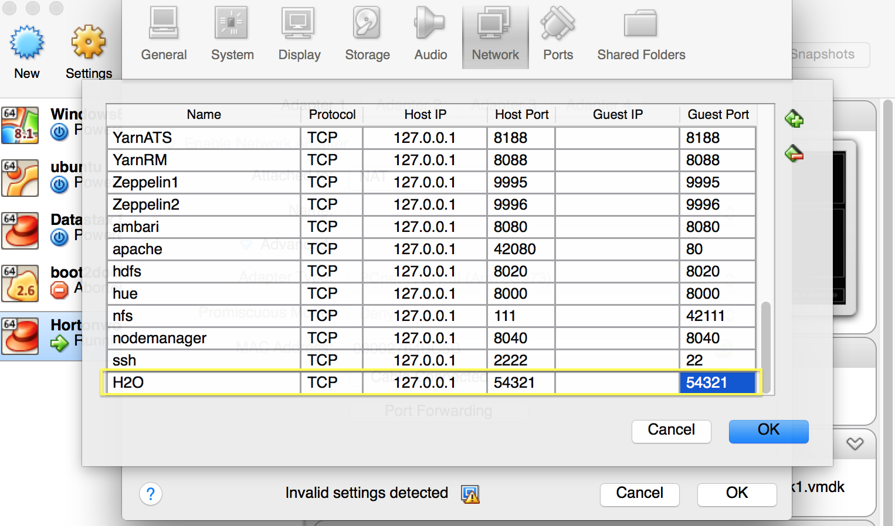
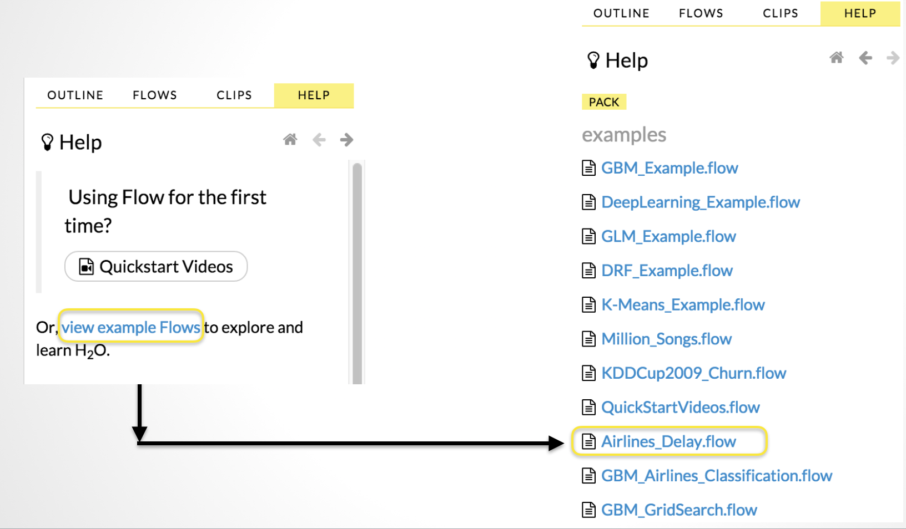

### Introduction

H2O is the open source in memory solution from H2O.ai for doing predictive analytics on big data. It is a math and machine learning engine that brings distributed and parallelized computation to powerful algorithms that enable you to iterate through many models faster and make better predictions.

With a uniform REST API, the R and Python client interfaces allow the user to write familiar code in traditional open source data science tools while using H2O in the back end. You can import data from S3, HDFS, local disk, or even databases using [Sparkling Water](http://h2o-release.s3.amazonaws.com/sparkling-water/rel-1.5/3/index.html).  H2O brings the ability to do advanced analytics to a broader audience of users. With an almost nonexistent learning curve for current Hadoop users, the following tutorial serves as a way to streamline the initial setup of H2O on Hortonwork's Sandbox.

### Prerequisites:

- Download the [Hortonworks Sandbox](http://hortonworks.com/sandbox)

### Overview

List the main steps needed to perform the procedure:

1.  Download the most current stable release of [H2O](http://h2o-release.s3.amazonaws.com/h2o/latest_stable)

2.  Launch H2O

3.	Run Analysis


### Step 1 - Download H2O zip file onto Hortonworks Sandbox

Boot Hortonworks Sandbox from VM. After which log in by hitting <Alt + F5> or use a terminal and ssh to root@127.0.0.1 -p 2222. The default password is `hadoop` and you will be prompt to change this password the first time you log on.

```
ssh root@127.0.0.1 -p 2222 
```

Make sure you have write permission on the account to a home directory in HDFS. If there is no home directory for the user root, create a home directory in HDFS and give it full write permission for user root. 

```
sudo -u hdfs hadoop fs -mkdir /user/root
sudo -u hdfs hadoop fs -chown root:root /user/root
```

Download the correction version of H2O driver jar file which is versioned for Hortonworks distributions. For example for HDP v2.3.2 please grab the hdp2.3 driver. The following an example of downloading release Tibshirani-11 for HDP 2.3 :

```
wget http://h2o-release.s3.amazonaws.com/h2o/rel-tibshirani/11/h2o-3.6.0.11-hdp2.3.zip
```

### Step 2 - Launch H2O

The next step is to launch H2O on the Hadoop node.

Unzip the H2O file, cd to h2o-[version] directory and run the following command (that will launch an one 1g node of H2O on a single Hadoop container:

```
unzip h2o-3.*.zip
cd h2o-3.*
hadoop jar h2odriver.jar -nodes 1 -mapperXmx 1g -output hdfsOutputDirName
```

Access the H2O embedded browser by going to any of the H2O nodes launched. Find the callback IP address H2O instance launched on and depending on the network settings pick the appropriate one to navigate to to find H2O's web interface. For example, if the VM is launched with Virtualbox Host-Only Ethernet Adapter H2O's web GUI is available at 192.168.56.102 and port 54321. You can also port forward the H2O Web UI by:

1. Navigate to `Settings` in VirtualBox for the Hortonworks VM.
2. Choose the `Network` tab.
3. Choose to edit `Port Forwarding` and add a new rule, called H2O, that can be accessed from your localhost at port 54321.



4. Access H2O at [http://localhost:54321](http://localhost:54321).

H2O is launched as a JVM on the Hadoop cluster, and the job can be tracked at the [Yarn Resource Manager](http://localhost:8088/cluster).


### Step 3 - Run Analyses

**Run a rebuilt Flow** 


Locate the data file you want to run regressions on in Hortonworks Sandbox after uploading the file from disk or after having played around with the dataset in hive or pig.

Import dataset in H2O browser from HDFS and start creating models with H2O’s available features including GLM, K-Means, and Random Forest to start with.

### About H2O

More H2O related tutorials and information are available at H2O current releases’ accompanying [documentation](http://h2o-release.s3.amazonaws.com/h2o/latest_stable_doc.html). Specifically there is more H2O on Hadoop documentation as well as walk through tutorials for most of the features available (GLM, K-Means, Random Forest, PCA, and GBM).

